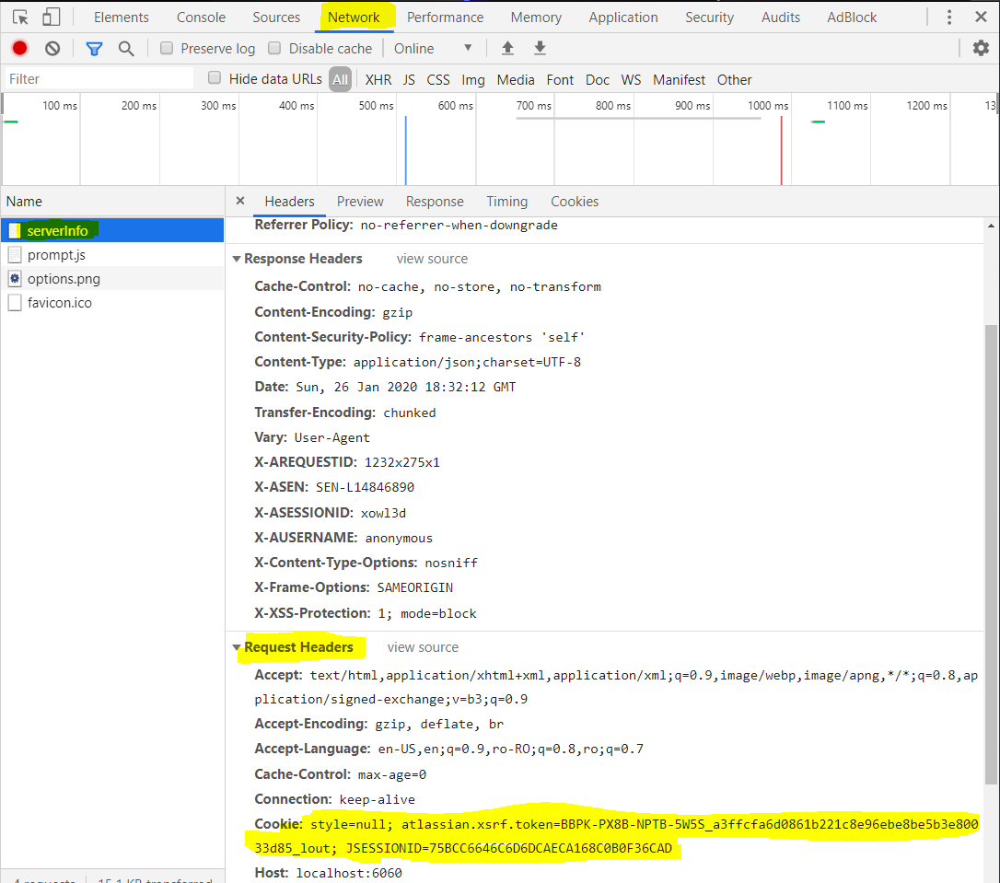

# Jira Miner
This app is a command line application built to extract Issue information from JIRA. 

Visit us on [Github](https://github.com/MarioRivis/jiraminer).
## Features
The application extracts the following fields from all JIRA Issues from the desired projects:
```     
      key: String;
      issueType: String;
      parentKey: String;
      status: String;
      startDate: String;
      endDate: String;
      summary: String;
      description: String;
      components: List<String>;
```
## Accessing the JIRA REST API
Before using the app, make sure you can access the JIRA REST API. go to your Jira page and log in. The access the following link:
`<your_jira_home>/rest/api/2/serverInfo`.

The server response should be a JSON that looks similar to this one:
```$xslt
{
    baseUrl: "<jira_home>",
    version: "8.3.4",
    versionNumbers: [
        8,
        3,
        4
    ],
    deploymentType: "Server",
    buildDate: "2019-09-13T00:00:00.000+0300",
    databaseBuildNumber: 803005,
    ...
    serverTitle: "Jira"
}
```


## Configuration
To run the application you first need to create a file called `config/jiraminer-config.properties` in the `config` folder next to the runnable files.
An example configuration file for a local environment could be:
```$xslt
projectID=
jira_home=http://localhost:6060
projects=COM
authentication=cookie
cookie=JSESSIONID=E96741F7E5C783D3FCC7E82E3874D51B; atlassian.xsrf.token=BBPK-PX8B-NPTB-5W5S_babd22b7c0c76f69c628902b0a08daf1e9bdb609_lin
```

The file has the following fields:

#### projectID
The analyzed project's ID. The value of this field will be used to prefix the result file.

#### jira_home
The url to the jira instance you want to extract the issues from. Examples: `http://localhos:8080`, `https://jira.<your_domain>.com`, `https//<your_domain>.com/jira`, etc.

#### projects
A list of comma separated strings representing the JIRA project IDs you want to extract issues from. For example if we would have 3 projects in our JIRA instance with the IDs: PRO, NUL and SAN and we sould only want the issues from NUL and SAN, we would populate the projects field as follows: 
`projects=NUL,SAM`

#### authentication
There are 4 possible values for this field:

##### basic
This field value requires two additional fields to be added to the configuration file: `username` and `password`, representing the username and the password of an authorized user who can access the JIRA REST API.
Example usage: 
```$xslt
...
authentication=basic
username=john.doe@my-company.com
password=Password123!
...
```

##### cookie
This field value requires one additional field to be added to the configuration file: `cookie`. The value of this field should be the cookie that the browser sends for an authorized user to access the JIRA Server instance.
To get this Cookie value, please open a browser, login to your JIRA Server instance and access the following link `<jira_home>/rest/api/2/serverInfo`

The server response should be a JSON that looks similar to this one:
```$xslt
{
    baseUrl: "<jira_home>",
    version: "8.3.4",
    versionNumbers: [
        8,
        3,
        4
    ],
    deploymentType: "Server",
    buildDate: "2019-09-13T00:00:00.000+0300",
    databaseBuildNumber: 803005,
    ...
    serverTitle: "Jira"
}
```

If you see a similar response, it means that you can access the Jira REST API using the cookie in your browser.
To get the cookie from your browser, open the _Developer Console_ (right click anywhere on the page and from the context menu select _Inspect_).

You should see a new Window open in your browser. Search for the _Network_ tab and refresh the page. You should see a list of requests being made.
Amongst them should be a request to _serverInfo_. Click on that request and look at the `Request Headers` Section. Copy the Cookie field value in the configuration file. 

NOTE: You may have multiple fields in your cookie. Copy the entire Cookie to the `jiraminer-config.properties` under the cookie field.

##### oauth
Not Yet Implemented!!!
##### none
The default value for the authentication field. If selected, and if the JIRA server or JIRA Cloud you are trying to connect to requires authentication for the REST API, JiraMiner will fail.


## Run
Run the `jiraminer.sh` or `jiraminer.bat` scripts to run the application after you have entered all fields to the configuration file (`config/jiraminer-config.properties`)